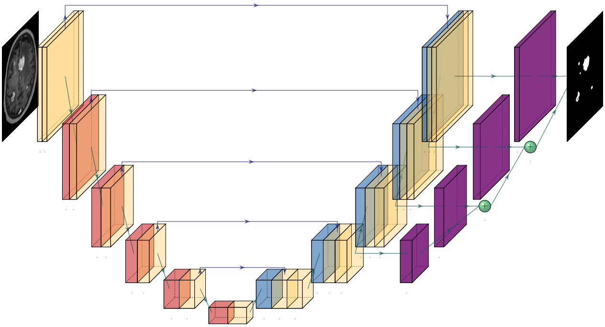

# Brain-Mets-Seg

This repository contains code for automatic segmentation of brain metastases on T1-weighted contrast-enhanced MRI using a 3D U-Net architecture. The model was trained and validated on a large, multi-institutional dataset comprising 1,546 MR scans from 6 public and 2 private sources. It was evaluated on a held-out test cohort of 885 MR scans. In addition to segmentation, the repository includes tools for: 1) generating voxel-wise uncertainty maps, 2) performing longitudinal lesion tracking over time, 3) calculating automatic RANO-BM measurements, and 4) classifying treatment response based on the RANO criteria.

## Table of Contents

- [Model Overview](#model-overview)
- [Setup](#setup)
- [Preprocessing](#preprocessing)
- [Automatic Segmentation](#automatic-segmentation)
- [Longitudinal Tracking](#longitudinal-tracking)
- [Auto-RANO-BM](#auto-rano-bm)

## Model Overview

We use a nearly identical network architecture, optimizer setting, and data augmentation pipeline as nnU-Net, written in Tensorflow 2.10 and NVIDIA DALI. Specifically, we use a 6 level 3D U-Net which takes a T1-weighted contrast-enhanced (T1-CE) sequence image as input and outputs a probability map of the likely brain metastases. We use 32 filters in the 3x3x3 convolutions in the first layer, and double this number of filters as we go deeper into the network, capping the the total number of filters to 320 due to GPU memory constraints. Feature map downsampling and upsampling is accomplished through strided convolution and transposed convolution, respectively. Instance Normalization in lieu of Batch Normalization is used in order to accommodate the smaller batch size necessary to train a large patch 3D model. Leaky rectified linear unit (Leaky ReLU) activation was used in all layers, with the exception of the final linear output. And to encourage faster convergence and ensure that deeper layers of the decoder are learning semantically useful features, we employ deep supervision by integrating segmentation outputs from all but the two deepest levels of the network. Our model was trained with the SGD optimizer, with the unweighted summation of boundary-weighted cross-entropy and dice coefficient as the loss function.

A diagram of the architecture is shown below.

## Setup

T

## Preprocessing

## Automatic Segmentation

S

## Longitudinal Tracking

G

## Auto-RANO-BM

G
